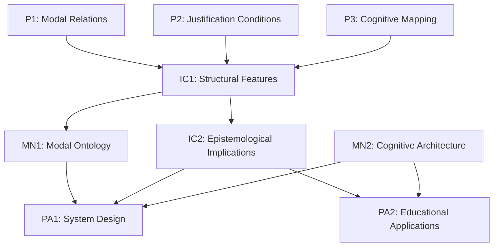

# Argument Structure: Modal Belief Asymmetry Framework - Refined Version

## Core Thesis
There exists a fundamental asymmetry in rational modal belief formation between necessity and possibility claims. This asymmetry reflects genuine features of modal reasoning rather than mere cognitive limitations, and can be formally characterized while remaining neutral on contested metaphysical positions.

## Formal Framework

### P1: Modal Belief Foundation
For any rational agent S and proposition p:
- $R_□(S,p)$ represents necessity-level belief justification
- $R_◇(S,p)$ represents possibility-level belief justification
- These relations are formally distinct: $R_□(S,p) \not\equiv \neg R_◇(S,\neg p)$

Formal definitions:
- $R_□(S,p) \equiv \exists x(J_x(S,p) \land V_□(x))$ where:
  - $J_x$ represents a justification chain
  - $V_□$ represents necessity-level validation criteria
- $R_◇(S,p) \equiv \exists x(J_x(S,p) \land V_◇(x))$ where:
  - $V_◇$ represents possibility-level validation criteria

### P2: Justification Asymmetry
For necessity beliefs:
- $R_□(S,p) \rightarrow Bel(S,□p)$ requires satisfaction of conditions $C_□$:
  1. $\forall q((p \rightarrow q) \rightarrow □q)$ (Logical closure)
  2. $\neg\exists r(Con(r) \land (r \rightarrow \neg p))$ (Counter-possibility resistance)
  3. $Stable(Bel(S,□p))$ under rational reflection

For possibility beliefs:
- $R_◇(S,p) \rightarrow Bel(S,◇p)$ requires satisfaction of conditions $C_◇$:
  1. $Con(p)$ (Logical consistency)
  2. $\neg\exists x(Proof_x(\neg◇p))$ (No impossibility proof)
  3. $MinCoh(p)$ (Minimal coherence)

### P3: Cognitive Architecture Integration
The formal relations map onto cognitive processes through:
1. $\phi: R_□ \rightarrow Sys2$ with validation threshold $t_□$
2. $\psi: R_◇ \rightarrow Sys1 \cup Sys2$ with threshold $t_◇$
3. $t_□ > t_◇$ (Asymmetric thresholds)

## Extended Analysis

### IC1: Structural Features
The asymmetry manifests in:
1. Validation criteria: $V_□(x)$ strictly stronger than $V_◇(x)$
2. Processing pathways: Necessity requires $Sys2$, possibility allows $Sys1$
3. Justification structure: $C_□$ hierarchically contains $C_◇$

### IC2: Epistemological Implications
The framework reveals:
1. Modal knowledge acquisition patterns
2. Relationship between intuitive and reflective modal judgments
3. Bounds on rational modal belief revision

## Metaphysical Neutrality

### MN1: Modal Ontology
The framework remains neutral between:
1. Modal realism
2. Epistemic accounts of modality
3. Conventionalist approaches

### MN2: Cognitive Architecture
Proposed processing distinctions are:
1. Empirically testable
2. Independent of metaphysical commitments
3. Functionally characterized

## Practical Applications

### PA1: Reasoning Systems Design
Framework enables:
1. Explicit validation criteria for modal claims
2. Structured approaches to modal belief revision
3. Integration with existing logical systems

### PA2: Educational Implementation
Supports development of:
1. Targeted modal reasoning exercises
2. Progress metrics for modal understanding
3. Adaptive teaching strategies

## Logical Structure

## Methodological Notes

1. Formal definitions provide precise characterization while maintaining philosophical accessibility
2. Empirical predictions are explicitly separated from metaphysical assumptions
3. Applications follow directly from theoretical framework
4. Integration with existing literature preserved through standard notation

This refined version maintains technical precision while addressing metaphysical concerns and strengthening practical applications. The framework provides clear paths for both theoretical development and empirical investigation.