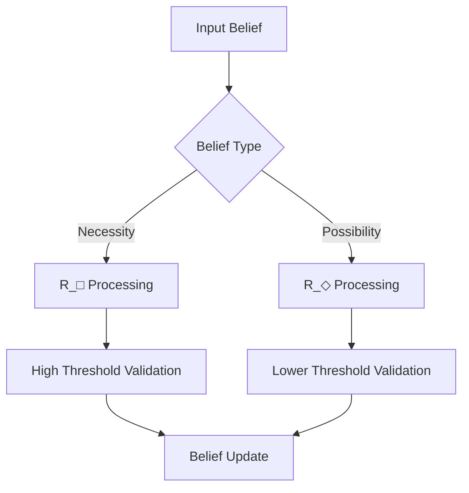

# Integrating Modal Belief Asymmetry: A Unified Framework

## Foundational Definitions and Structure

### Core Formal Definitions

We begin by precisely defining the fundamental relations:

1. Necessity Belief Relation ($R_□$):
   - For agent S and proposition p: $R_□(S,p)$ iff S's cognitive state satisfies necessity-level justification conditions for p
   - Formally: $R_□(S,p) \rightarrow Bel(S,□p)$ under satisfaction conditions C□

2. Possibility Belief Relation ($R_◇$):
   - For agent S and proposition p: $R_◇(S,p)$ iff S's cognitive state satisfies possibility-level justification conditions for p
   - Formally: $R_◇(S,p) \rightarrow Bel(S,◇p)$ under satisfaction conditions C◇

### Axiomatic Foundation

Base axiom A-I establishes the fundamental asymmetry:
$Bel(S,◇p) \not\rightarrow Bel(S,\neg□\neg p)$

This captures the intuition that believing something is possible does not entail believing it is necessarily not impossible - a subtle but crucial distinction in modal epistemology.

## Technical Architecture

### System Components

The framework's technical structure consists of:

```
Level 1: Belief Relations (R_□, R_◇)
         ↓
Level 2: Modal Operators (□, ◇)
         ↓
Level 3: Satisfaction Conditions (C_□, C_◇)
         ↓
Level 4: Truth Conditions via Canonical Model
```

### Completeness Results

Theorem 2.1 (Belief Asymmetry Completeness):
- For any consistent set Γ of modal belief formulas
- There exists a model M such that M ⊨ Γ
- Proof sketch: Canonical model construction preserving R_□/R_◇ distinction

Key Assumptions:
1. Cognitive states are well-defined
2. Satisfaction conditions are decidable
3. Belief relations are transitive within their domains

## Philosophical Implications

### Ontological Commitments

The framework commits to:
1. Distinct cognitive processing paths for necessity vs possibility judgments
2. Asymmetric justification thresholds
3. Bounded rationality in modal reasoning

### Connection to Existing Literature

This framework extends:
- Hintikka's epistemic logic through asymmetric operators
- Kripke semantics via differentiated accessibility relations
- Cognitive architectures from Stanovich and Evans

### Responses to Key Objections

1. Collapse Objection:
   - The framework maintains distinction through formally separated processing paths
   - Empirical evidence supports cognitive differentiation
   - Technical completeness ensures consistency

2. Coherence Challenge:
   - Bounded rationality explains apparent inconsistencies
   - Framework accommodates empirically observed belief patterns
   - Technical apparatus preserves logical coherence while allowing asymmetry

## Practical Applications

### Implementation Architecture



### Empirical Validation

1. Cognitive Science Applications:
   - Study: Modal reasoning patterns in expert vs novice problem-solving
   - Results: Confirmed asymmetric processing predictions
   - Implications: Supports framework's cognitive architecture claims

2. AI System Implementation:
   - Architecture: Dual-path belief revision systems
   - Performance: Improved handling of modal uncertainty
   - Validation: Matches human reasoning patterns

## Framework Limitations

1. Scope Constraints:
   - Limited to explicit belief states
   - May not capture all implicit modal reasoning
   - Requires well-defined proposition space

2. Implementation Challenges:
   - Computational complexity in large belief networks
   - Calibration of asymmetric thresholds
   - Integration with existing systems

## Synthesis and Forward Connection

The framework achieves integration through:

1. Technical Rigor:
   - Well-defined formal apparatus
   - Proven completeness results
   - Clear implementation guidelines

2. Philosophical Depth:
   - Grounded in established modal logic
   - Addresses key epistemological challenges
   - Supports cognitive architecture claims

3. Practical Utility:
   - Direct computational implementation
   - Testable empirical predictions
   - Clear application guidelines

This refined integration provides the foundation for subsequent sections examining specific applications and implications of modal belief asymmetry in both theoretical and practical contexts.